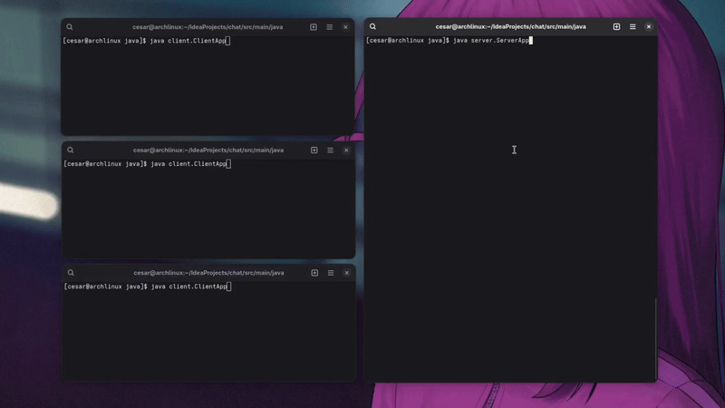

# ChatBox 💬
Esta é uma aplicação de chat simples com um modelo cliente/servidor usando TCP. O cliente se conecta ao servidor e envia mensagens que são retransmitidas 
para todos os outros clientes conectados. A comunicação é bidirecional e usa sockets TCP/IP para a troca de dados entre o cliente e o servidor possibilitando a comunicação entre os clientes.
<br><br>


## 📌 Objetivo do Projeto

O objetivo deste projeto foi entender, de forma prática, como funciona a comunicação entre cliente e servidor utilizando sockets e o protocolo TCP/IP em Java. 
Busquei explorar conceitos fundamentais como gerenciamento de conexões, concorrência, controle de fluxo e estruturação de aplicações de rede, sem depender de bibliotecas externas, para ter uma visão mais aprofundada dos mecanismos envolvidos.

---

## 🛠️ Tecnologias Utilizadas

- **Java** – Linguagem principal para lógica de aplicação.
- **Sockets TCP/IP** – Base para comunicação entre cliente e servidor.
- **Java Threads** – Para tratar múltiplos clientes simultaneamente.
- **Logger (`java.util.logging`)** – Para registro de eventos e depuração.
- **Collections (`CopyOnWriteArrayList`)** – Para lidar com concorrência entre múltiplos clientes conectados.
- **JUnit5 e Mockito** - Para testes unitários.

---

## 📚 Estrutura do Projeto

- `client/`: Contém o código-fonte da aplicação cliente.
- `server/`: Contém o código-fonte da aplicação servidor.
- Comunicação baseada em sockets TCP.
- Mensagens trocadas via terminal (texto).

---

## 🧠 Decisões de Projeto e Justificativas Técnicas

Durante o desenvolvimento, tomei algumas decisões com base na minha intenção de aprender os fundamentos da comunicação em rede com Java. Abaixo, explico as escolhas técnicas feitas:

### 1. Utilização do Protocolo TCP/IP com Sockets

Escolhi usar o protocolo TCP/IP por sua confiabilidade e controle sobre o fluxo de dados. Com ele, pude implementar comunicação ponto a ponto usando `Socket` e `ServerSocket`, sem depender de frameworks externos, o que me deu uma visão clara do que ocorre “por baixo dos panos”.

### 2. Organização em Pacotes (`client` e `server`)

Decidi dividir o código entre os pacotes `client` e `server` para manter uma organização lógica, separando responsabilidades e facilitando a manutenção do código no futuro.

### 3. Criação de Threads por Cliente

Implementei uma thread separada para cada cliente conectado ao servidor, com o objetivo de permitir múltiplas conexões simultâneas. Isso me ajudou a entender melhor como funciona a programação concorrente com threads em Java.

### 4. Uso de `CopyOnWriteArrayList` para Conexões

Para armazenar e gerenciar os clientes conectados, utilizei a estrutura `CopyOnWriteArrayList`, pois ela é segura para ambientes multithread e me permitiu realizar iterações e modificações simultaneamente sem erros.

### 5. Separação do Envio e da Leitura no Cliente

No lado do cliente, escolhi separar os fluxos de envio e recepção de mensagens: um ocorre na thread principal e o outro em uma thread paralela. Isso evita bloqueios e garante que o cliente continue recebendo mensagens mesmo enquanto digita.

### 6. Uso de `BufferedReader` e `BufferedWriter`

Utilizei `BufferedReader` e `BufferedWriter` para leitura e escrita de mensagens em texto sobre o socket. Essa escolha me permitiu manipular as mensagens linha a linha de forma eficiente e organizada.

### 7. Entrada de Dados com `Scanner`

Utilizei o `Scanner` para facilitar a entrada de dados via terminal, tanto para a escolha do nome de usuário quanto para envio de mensagens.

### 8. Implementação de Broadcast de Mensagens

Implementei um sistema de broadcast no servidor para que as mensagens de um cliente fossem enviadas a todos os demais conectados, simulando um comportamento de chat em grupo.

### 9. Encerramento Ordenado das Conexões

Implementei um controle para que, ao digitar `"exit"`, o cliente encerrasse sua conexão de forma limpa, liberando corretamente os recursos (streams e sockets) e notificando os demais usuários.

### 10. Registro de Logs com `Logger`

Adotei o `Logger` do Java para registrar eventos como conexões, desconexões e exceções. Isso foi útil tanto para depuração quanto para entender melhor o comportamento do sistema durante a execução.

---

## 🧪 Possíveis Melhorias

- Uso de thread pool para permitir controlar melhor a quantidade de threads ativas, reaproveitando elas para reduzir o custo de criação e destruição contínua para ajuda a evitar o consumo excessivo de recursos do sistema,
melhora a performance e torna o servidor mais estável e escalável para atender muitos clientes simultaneamente.
- Criptografia das mensagens
- Autenticação de usuários
- Persistência em banco de dados

---

## 🚀 Como executar

### 📦 Requisitos
- Java JDK 8 ou superior

### ▶️ Executando o servidor

```bash
cd src
javac server/*.java
java server.ServerApp
```

### 🖥️ Executando o cliente

Em outro terminal:

```bash
cd src
javac client/*.java
java client.ClientApp
```

---

## 📖 Referências

📘 TCP/IP Sockets in Java: Practical Guide for Programmers por Kenneth L. Calvert e Michael J. Donahoo. <br>
📘 Java How To Program (10th Edition) por P.J. Deitel. <br>
📘 Computer Networking - A Top-Down Approach por James F. Kurose e Keith W. Ross. <br>
🎥️🧑‍🏫 Java Socket Programming - Multiple Clients Chat por WittCode. [Vídeo no YouTube](https://www.youtube.com/watch?v=gLfuZrrfKes)

